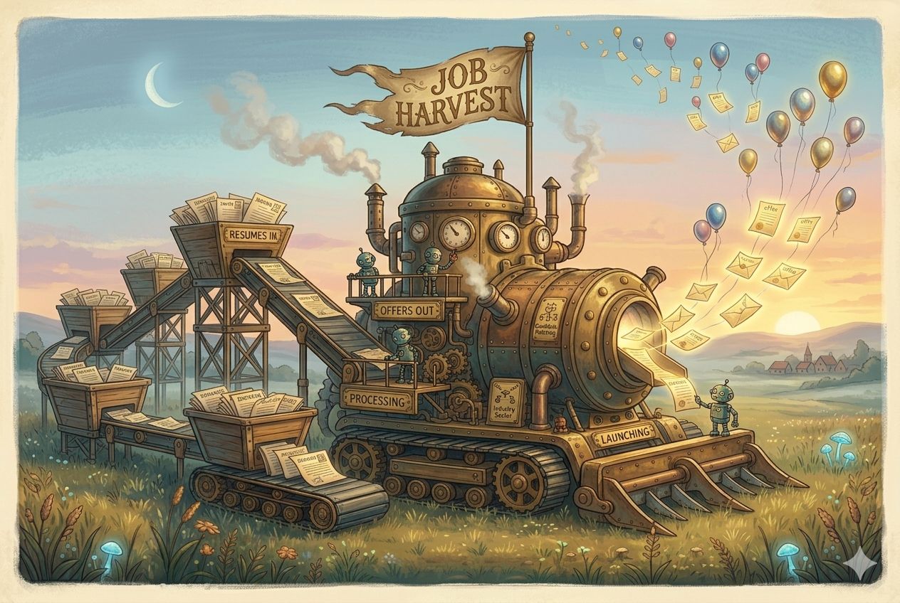

# Career-Ops

> Forked from [santifer/career-ops](https://github.com/santifer/career-ops) and customized for my Analytics Engineer / Staff Data Analyst job search.

<p align="center">
  <em>Companies use AI to filter candidates. I use AI to filter companies.</em>
</p>

<p align="center">
  
  
  
  
</p>

---

<p align="center">
  
</p>

## What Is This

Career-Ops turns Claude Code into a job search command center. Instead of tracking applications in a spreadsheet, I get an AI-powered pipeline that

- **Evaluates offers** against my CV with a structured A-F scoring system
- **Generates tailored CVs** as ATS-optimized PDFs per job description
- **Scans portals** automatically across Greenhouse, Ashby, Lever, and tracked company pages
- **Processes in batch** so I can evaluate many offers in parallel
- **Tracks everything** in a single source of truth with integrity checks

This is a filter, not a spray-and-pray tool. The system recommends against applying to anything scoring below 4.0/5. My time is valuable and so is the recruiter's.

The agent navigates career pages with Playwright, evaluates fit by reasoning about my CV against each job description, and adapts my resume per listing. It does not submit applications. I always have the final call.

The first evaluations were rough because the system did not know me yet. The more context I feed it (CV, proof points, deal-breakers, comp targets, archetype framing), the sharper the recommendations get.

## Features

| Feature | Description |
|---------|-------------|
| **Auto-Pipeline** | Paste a URL, get a full evaluation, PDF, and tracker entry |
| **6-Block Evaluation** | Role summary, CV match, level strategy, comp research, personalization, interview prep (STAR+R) |
| **Interview Story Bank** | STAR+Reflection stories accumulated across evaluations |
| **Negotiation Scripts** | Salary frameworks, geographic tier pushback, competing offer leverage |
| **ATS PDF Generation** | Keyword-injected CVs with a clean ATS-friendly template |
| **Portal Scanner** | Tracked companies plus custom queries across Ashby, Greenhouse, Lever, Wellfound |
| **Batch Processing** | Parallel evaluation with `claude -p` workers |
| **Human-in-the-Loop** | The system never submits applications. I always review before sending. |
| **Pipeline Integrity** | Automated merge, dedup, status normalization, health checks |

## Quick Start

```bash
# 1. Clone and install
git clone https://github.com/ericwagnergithub/career-ops.git
cd career-ops && npm install
npx playwright install chromium   # Required for PDF generation

# 2. Check setup
npm run doctor

# 3. Configure
cp config/profile.example.yml config/profile.yml
cp templates/portals.example.yml portals.yml

# 4. Add your CV
# Create cv.md in the project root

# 5. Open Claude Code
claude

# 6. Start using
# Paste a job URL or run /career-ops
```

The system is designed to be customized by Claude itself. Modes, archetypes, scoring weights, negotiation scripts. Just ask Claude to change them.

See [docs/SETUP.md](docs/SETUP.md) for the full setup guide.

## Usage

```
/career-ops                → Show all available commands
/career-ops {paste a JD}   → Full auto-pipeline (evaluate + PDF + tracker)
/career-ops scan           → Scan portals for new offers
/career-ops pdf            → Generate ATS-optimized CV
/career-ops batch          → Batch evaluate multiple offers
/career-ops tracker        → View application status
/career-ops apply          → Fill application forms with AI
/career-ops pipeline       → Process pending URLs
/career-ops contact        → LinkedIn outreach message
/career-ops deep           → Deep company research
/career-ops training       → Evaluate a course or cert
/career-ops project        → Evaluate a portfolio project
```

Or paste a job URL or description directly. Career-ops auto-detects it and runs the full pipeline.

## How It Works

```
You paste a job URL or description
        │
        ▼
┌──────────────────┐
│  Archetype       │  Classifies the role (AE, Staff Analyst, Data Platform, AI-augmented)
│  Detection       │
└────────┬─────────┘
         │
┌────────▼─────────┐
│  A-F Evaluation  │  Match, gaps, comp research, STAR stories
│  (reads cv.md)   │
└────────┬─────────┘
         │
    ┌────┼────┐
    ▼    ▼    ▼
 Report  PDF  Tracker
  .md   .pdf   .tsv
```

## Tracked Portals

The scanner runs against Ashby, Greenhouse, Lever, and Wellfound, plus a curated list of tracked companies whose career pages are checked directly. The list is tuned for analytics engineering, staff data analyst, and AI-augmented analytics roles. Edit `portals.yml` to add or disable companies.

## Project Structure

```
career-ops/
├── CLAUDE.md                    # Agent instructions
├── cv.md                        # My CV
├── article-digest.md            # Proof points (optional)
├── config/
│   └── profile.yml              # My profile
├── modes/                       # Skill modes
│   ├── _shared.md               # System rules
│   ├── _profile.md              # My customizations (never auto-updated)
│   ├── evaluate.md              # Single evaluation
│   ├── pdf.md                   # PDF generation
│   ├── scan.md                  # Portal scanner
│   └── batch.md                 # Batch processing
├── templates/
│   ├── cv-template.html         # ATS-optimized CV template
│   ├── portals.example.yml      # Scanner config template
│   └── states.yml               # Canonical statuses
├── batch/
│   ├── batch-prompt.md          # Worker prompt
│   └── batch-runner.sh          # Orchestrator
├── data/                        # Tracking data (gitignored)
├── reports/                     # Evaluation reports (gitignored)
├── output/                      # Generated PDFs (gitignored)
├── fonts/                       # CV template fonts
└── docs/                        # Setup and architecture
```

## Tech Stack

- **Agent.** Claude Code with custom skills and modes
- **PDF.** Playwright + HTML template
- **Scanner.** Playwright, Greenhouse API, WebSearch
- **Data.** Markdown tables, YAML config, TSV batch files

## Origin

Forked from [santifer/career-ops](https://github.com/santifer/career-ops). Santiago built the original system to run his own job search and open-sourced it. The archetypes, scoring logic, mode files, and PDF template all started from his work. I have since rebranded the README, retargeted the archetypes to analytics engineering and staff analyst roles, and dropped the components I do not use (Go dashboard TUI, multi-language docs, OpenCode and Codex variants). The original case study is at [santifer.io/career-ops-system](https://santifer.io/career-ops-system).

## Disclaimer

**Career-ops is a local, open-source tool, not a hosted service.** By using this software you acknowledge

1. **You control your data.** Your CV, contact info, and personal data stay on your machine and are sent directly to the AI provider you choose (Anthropic, OpenAI, etc.). No data is collected, stored, or accessible to anyone else.
2. **You control the AI.** The default prompts instruct the AI not to auto-submit applications, but AI models can behave unpredictably. If you modify the prompts or use different models, you do so at your own risk. Always review AI-generated content for accuracy before submitting.
3. **You comply with third-party ToS.** You must use this tool in accordance with the Terms of Service of the career portals you interact with (Greenhouse, Lever, Workday, LinkedIn, etc.). Do not use this tool to spam employers or overwhelm ATS systems.
4. **No guarantees.** Evaluations are recommendations, not truth. AI models may hallucinate skills or experience. The authors are not liable for employment outcomes, rejected applications, account restrictions, or any other consequences.

See [LEGAL_DISCLAIMER.md](LEGAL_DISCLAIMER.md) for full details. This software is provided under the [MIT License](LICENSE) "as is", without warranty of any kind.

## License

MIT
